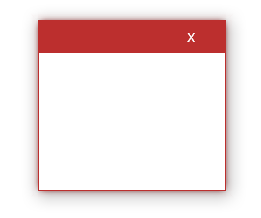

# GlowWindowControl 
Wpf Window control with glow effect.

based on [GlowWindow](https://github.com/TheCentralScrutinizer/GlowWindow)

## effect

<table width="100%">
    <tr>
      <td/>
      <td>Active</td>
      <td>InActive</td>
   </tr>
   <tr>
      <td>Default</td>
      <td></td>
      <td></td>
   </tr>
   <tr>
      <td>Glow</td>
      <td></td>
      <td></td>
   </tr>
</table>